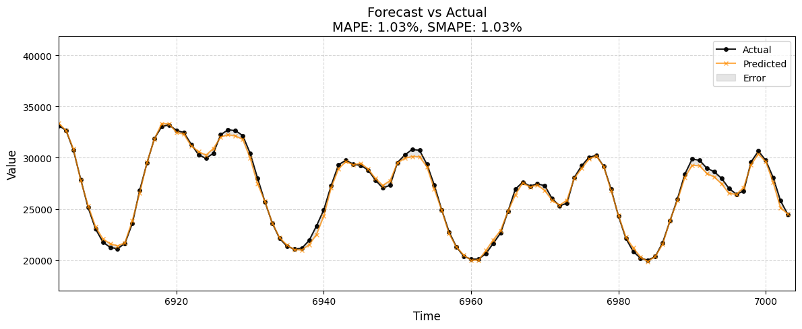

# ⚡ WattsNext: Forecasting the Future of Energy Mix

**WattsNext** is a machine learning-powered tool for forecasting the composition of a country’s energy mix — including renewables, coal, natural gas, and more. Built using **LSTM** and **XGBoost**, it helps grid operators, analysts, and policymakers anticipate energy trends and make data-driven decisions for a sustainable future.

---

## 🌍 Why WattsNext?

As the world transitions to greener energy, knowing *what’s next* in the energy mix is crucial. This project helps:

- Improve **grid stability** with accurate forecasting  
- Optimize **renewable energy usage**  
- Reduce **operational costs** and **emissions**

---

## 🔧 Key Features

- 📈 Time-series modeling with **XGBoost** and **LSTM**
- 🔍 Smart preprocessing and trend-aware feature engineering
- 📊 Visual insights: actual vs predicted energy mix , residuals
- ♻️ Sustainability-focused: highlight renewables and carbon impact

---

## 📁 Expected Dataset Format
Your dataset should ideally contain:
- A datetime column (e.g., `time`, `timestamp`)
- One or more energy consumption columns (e.g., `total load actual`)

The script auto-detects the column names and handles:
- Timezone conversions
- Missing values
- Datetime features (hour, day of week, etc.)

## 💡 Example Dataset Columns
- `time` or `datetime`
- `total load actual`
- `generation fossil gas`
- `generation solar`, `generation wind onshore`, etc.


## 🗂️ Project Structure

```
WattsNext/
├── data/                  # Raw and processed datasets
├── notebooks/             # Exploratory analysis and model training
├── models/                # Saved models and evaluation metrics
├── utils/                 # Helper functions for pipeline
├── main.py                # Entry point for training/testing
├── requirements.txt
└── README.md
```
---

## ▶️ How to Run
Upload your dataset in `.csv` format and run `WattsNext_Forecasting_Universal.ipynb`.  
Adjust the `target_column` or timestamp parsing logic if your dataset is structured differently.


## 🚀 Quick Start

```bash
git clone https://github.com/similalwani/WattsNext.git
cd WattsNext
pip install -r requirements.txt
python main.py

```

## 🔬 Models Used
-	XGBoostRegressor for baseline predictions
-	LSTM for capturing temporal patterns in energy trends
-	Support for seasonal decomposition and lag-based features

⸻

## 📊 Forecast plot


⸻

## ✅ Requirements

- Python 3.8+
- pandas, numpy, scikit-learn
- xgboost
- torch/keras (for LSTM)
- matplotlib/seaborn

## Contribute

Pull requests are welcome! If you’ve got ideas to improve energy forecasting or integrate real-time data sources, let’s build it together.


